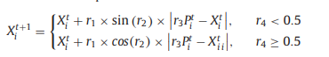
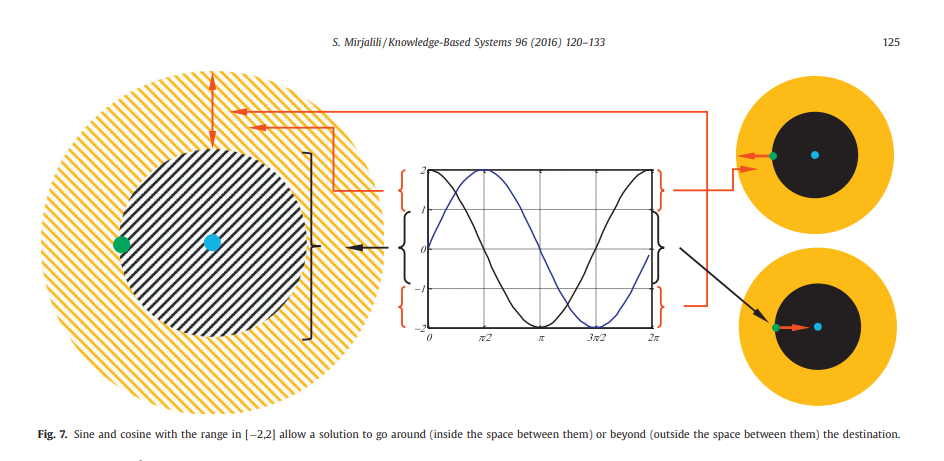

# Bachelors Thesis - Department of Informatics and Telecommunications University of Athens
## Aris Tsilifonis 1115201700170 (sdi1700170)

## Table of contents
* [General info](#general-info)
* [Structure](#structure)
* [Functionality](#functionality)
* [Results](#results)
* [Technologies](#technologies)
* [Setup](#setup)

## General info
The topic of this project is Sine Cosine Optimization Algorithm which is a category of Swarm Intelligence-based algorithms(Genetic Algorithms/Artificial intelligence).As a subject of my thesis , this work aims to provide a black box solution which can be implemented to a variety of complex
problems through a sine and cosine equation. Population based processes are created by randomly produced solutions which the main program 
tries to improve in order to reach global optimal value . 


	
## Technologies
Project is created with:
* Ubuntu version: Ubuntu 20.04.3 LTS
* g++ version: g++ (Ubuntu 9.3.0-17ubuntu1~20.04) 9.3.0
* Visual Studio version : code 1.74.2
tested in DiT UoA linux systems

## Setup
### To run this project, run makefile

```
$ make run
 or
$ make
$ ./sca_prog config.txt 30 6 20 10.0 30.00
$ make clean
```
### To erase csv produced files, type this inside the thesis folder
```
$ find $thesis -type f -name "*.csv" -delete
```
### Usage
```
arguments: config_opt_file num_runs function_id dimensions range_min range_max
```
Explaination of arguments: 
1. config_opt_file: configuration file containing information such as r3,a,size of population ( solutions ) which the algorithm needs
2. num_runs: Executions of Sine Cosine algorithm
3. function_id: Id of criterion function
4. dimensions: Dimension of every solution (every member of population)
5. range_min,range_max:Random number occupying a position in each dimension (ex dim = 3 (x,y,z) where x,y,z are random numbers in the specified range)

## Structure

```
The program consists of 6 classes : 
1. Simulator
2. SineCosine
3. PopulationCriterion
4. Population 
5. functions
6. Utility(clock)

and 1 Helper header file:
1. debuglvl.hpp
```
Regarding the simulator class ,  it is responsible for parsing configuration file and sine cosine algorithm parameters .Also , it has to execute SCA and
compute important statistics about the SCA process . Moreover , an output csv file is produced containing all the important information about the algorithm. It should be noted that different output files may produced based on the specific information that you want to export.For instance, by uncommenting #define debug1 in debuglvl.hpp and typing #define debug1 in simulator.cpp at the start of the file, you can run specific macro instruction which prints results in the form:
sca,function_type,num_runs,dimension,min_range_random,max_range_random,mean_value,standard_deviation,range,median_value,time_milsec,min_range,max_range
For debug2 I provide sca_algorithm_fx_iter.csv file,keeping track of every update in global optimal value throughout every iteration.
About debug3 , it tracks how the global optimal cost was before and after the run of sca algorithm .Obviously , it is significantly better after the execution of the algorithm.
Sine Cosine Class contains a struct which include the parameters of sca algorithm and also a class for its method.
Population class is inherited by population criterion class and it contains the getters and setters of the dataset of sca algorithm as well as a function for printing it. Additionally ,it forms the population by assigning random numbers in the given range to every dimension.
The purpose of population criterion class is to evaluate every produced solution by a criterion function (from the given paper) and storing the minimum
cost value and its position in the dataset array . In this way , it can be extracted by SCA class . 
Utility class calculates the exact time the process needed to be completed.
Finally , function class returns a pointer to a specific criterion function. In detail function class returns: 
(multimodal) Schwefels,DeJongs1, Rastrigin , Griewank ,Ackleys ,(unimodal)f6 step
note: A function with multiple peaks or valleys is a multimodal function

## Functionality
Actually , most of the source files are described in the section above. Here , I will cover the main logic behind sca function (sinecosine.hpp file).
The algorithm operates by creating the dynamic dataset and initializing it with random values in each dimension. Specifically the dataset size equals to the size of population multiplied with the number of dimensions. Every dimension is a double precision floating point number in this project. I used mersenne twister as it is the most recommended random number generator. For every item of the population, I update its vector by producing a new one with sine cosine equation. I took care of out of range values by limiting them to the edges of the range and not letting them be outside of it.After this work for every element of the array is completed, I update the global optimal value by checking if the current minimum value is less than the global optimum.
If yes then I assign the updated value to the globally best one.This is the output of our algorithm which is printed in the aforementioned files.
What the sine cosine equation tells is well explained in pg.5 of the given paper(pdf) in sources:
```
This figure shows how changing the range of sine and cosine functions requires a solution to update its position outside or inside the space
between itself and another solution
``` 


## Results
To generate : `./sca_prog config.txt 30 6 20 10.0 30.00`
I experimented with minimum and maximum range .You can test various values as long as they are positive and the maximum is greater than the minimum(floating point) .Number of runs ranged between 5-50.I tested all the 6 functions and the cost value varied from one to another. Nevertheless, every value was reduced by applying the SCA algorithm. Finally , passing above 50.0 for the dimension parameter slow down the performance of the specific program so we
focus between  between 2-30.

## Expand work
Some variations of SCA algoirthm are anticipated in the near future.


## Sources
SCA: A Sine Cosine Algorithm for solving optimization problems [Seyedali Mirjalili]

[@statistics](https://stackoverflow.com/questions/2114797/compute-median-of-values-stored-in-vector-c)

[@debug macros](https://stackoverflow.com/questions/14251038/debug-macros-in-c)

SCA Variants

[@Fuzzy SCA](https://ietresearch.onlinelibrary.wiley.com/doi/10.1049/iet-gtd.2018.6489)

[@Adaptive Chaotic SCA](https://www.hindawi.com/journals/complexity/2020/6084917/)

[@Greedy Levy Mutation](https://www.hindawi.com/journals/cin/2018/4231647/)

[@Single- and Multi-Objective Modified Aquila Optimizer](https://www.mdpi.com/2227-7390/10/12/2129)

[@Improved Opposition - based learning SCA](https://reader.elsevier.com/reader/sd/pii/S0957417417305201?token=A91982FA83826AEA5C6260F342D2DF10496D5AABA909FCC7A9D416D48ED2EF3D71C4F5EFAB35F2BCFA39B709DF1A2AC9&originRegion=eu-west-1&originCreation=20230315001038)

[@Binary Sine Cosine with Refraction Learning and Opposition - based learning](https://link.springer.com/article/10.1007/s10489-022-04201-z#Equ4)

[@Tension/compression spring design problem](https://ceur-ws.org/Vol-2255/paper2.pdf)


